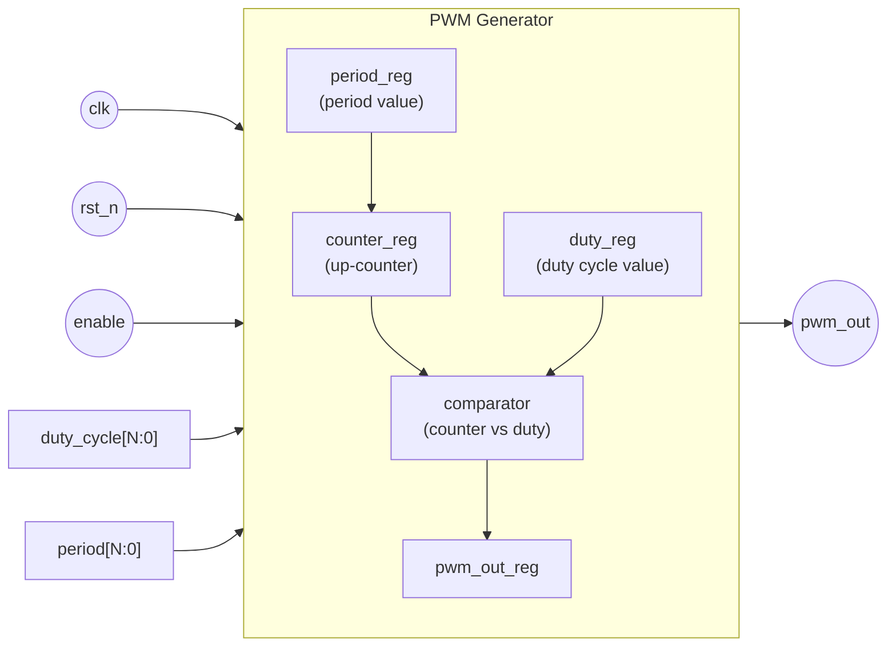

## 98. PWM Generator (Parameterized Duty Cycle)

### Description
This module implements a digital Pulse-Width Modulation (PWM) generator with a configurable duty cycle. It uses a free-running binary counter and a digital magnitude comparator to produce a square wave output whose high-time ratio (duty cycle) is determined dynamically by the input port.

When the internal counter value is strictly less than the target duty threshold, the output stays HIGH (`1`); once the counter reaches or exceeds the threshold, the output transitions to LOW (`0`).

---

### Hardware Architecture & Waveform
## Block Diagram

### Ports

| Port          | Direction | Width  | Description                              |
|---------------|-----------|--------|-------------------------------------------|
| `clk`         | Input     | 1 bit  | System clock                              |
| `rst_n`       | Input     | 1 bit  | Active-low asynchronous reset             |
| `enable`      | Input     | 1 bit  | Enables PWM operation                     |
| `duty_cycle`  | Input     | N bits | Desired duty cycle value                  |
| `period`      | Input     | N bits | PWM period (counter max value)            |
| `pwm_out`     | Output    | 1 bit  | Generated PWM waveform                    |

### Internal Registers

| Register       | Width  | Description                                      |
|----------------|--------|---------------------------------------------------|
| `counter_reg`  | N bits | Free-running/up-counter, resets at `period_reg`   |
| `duty_reg`     | N bits | Latched duty cycle value used for comparison      |
| `period_reg`   | N bits | Latched period value                              |
| `pwm_out_reg`  | 1 bit  | Registered output driving `pwm_out`               |

### Module Ports & Signals

| Signal Name | Direction | Bit Width | Description |
| :--- | :--- | :--- | :--- |
| `clk` | Input | 1-bit | System clock signal driving the counter |
| `rst` | Input | 1-bit | Active-high asynchronous reset signal |
| `duty` | Input | 8-bit (`[7:0]`) | Input threshold determining the active-high pulse duration (0–255) |
| `pwm_out` | Output | 1-bit | Generated PWM square-wave signal |

---

### Duty Cycle Calculation

The duty cycle percentage is given by the formula:

$$\text{Duty Cycle (\%)} = \left( \frac{\text{duty}}{256} \right) \times 100$$

* **`duty = 8'd0`** $\rightarrow$ **0% Duty Cycle** (Output remains continuously LOW)
* **`duty = 8'd64`** $\rightarrow$ **25% Duty Cycle**
* **`duty = 8'd128`** $\rightarrow$ **50% Duty Cycle** (Balanced square wave)
* **`duty = 8'd192`** $\rightarrow$ **75% Duty Cycle**
* **`duty = 8'd255`** $\rightarrow$ **99.6% Duty Cycle**

---
